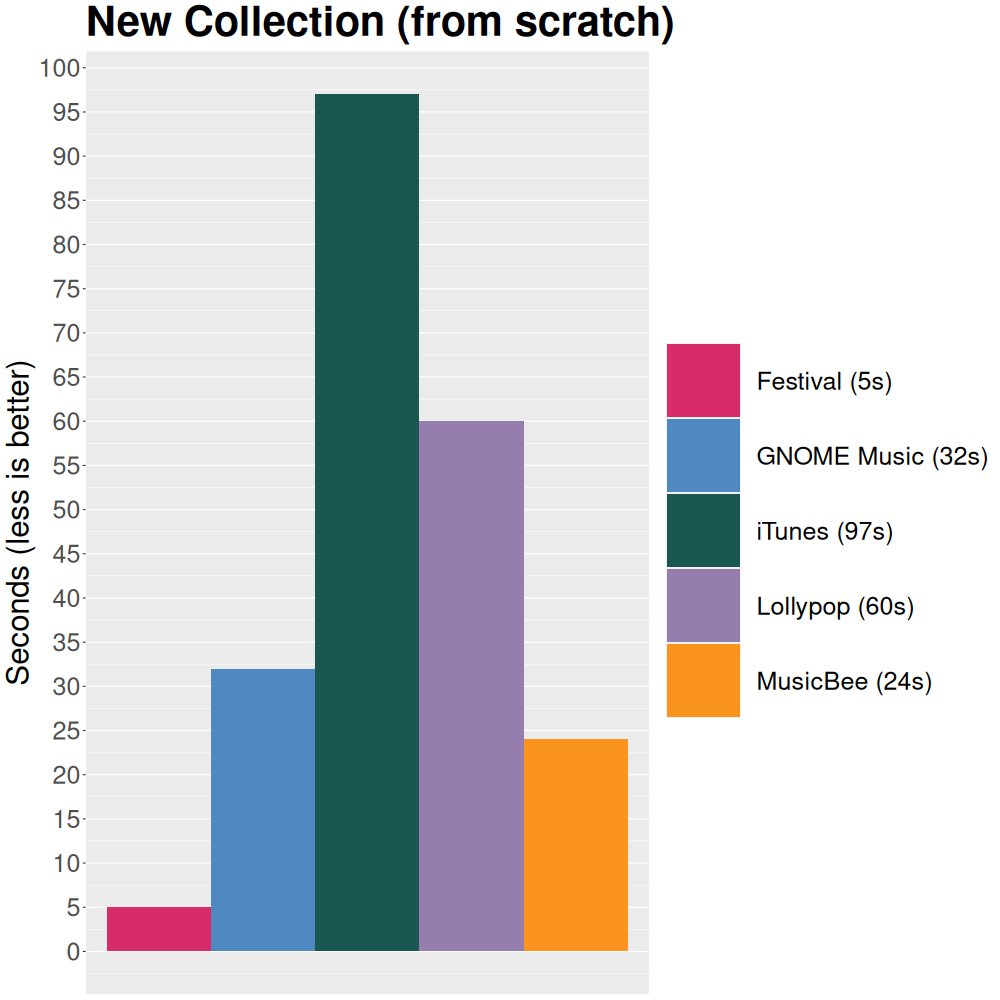
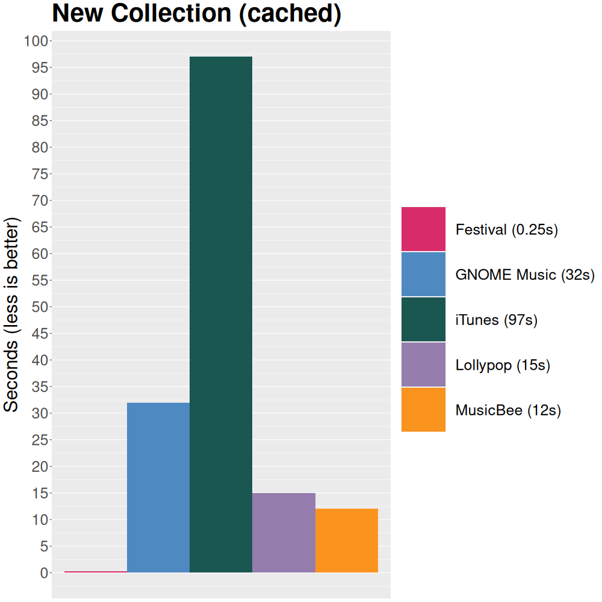
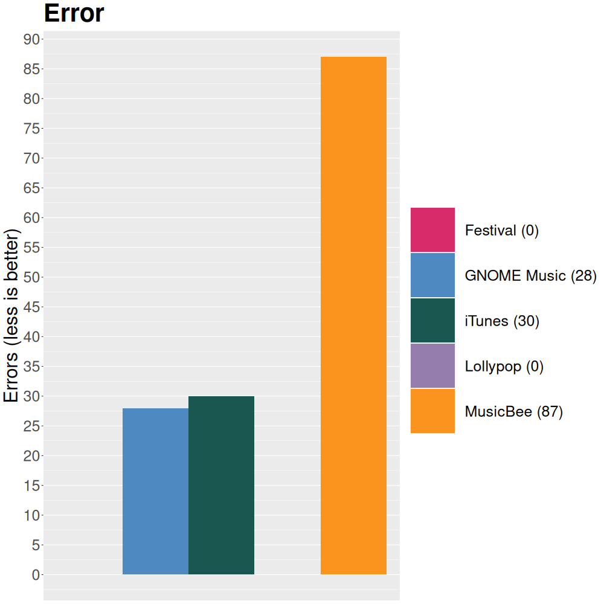
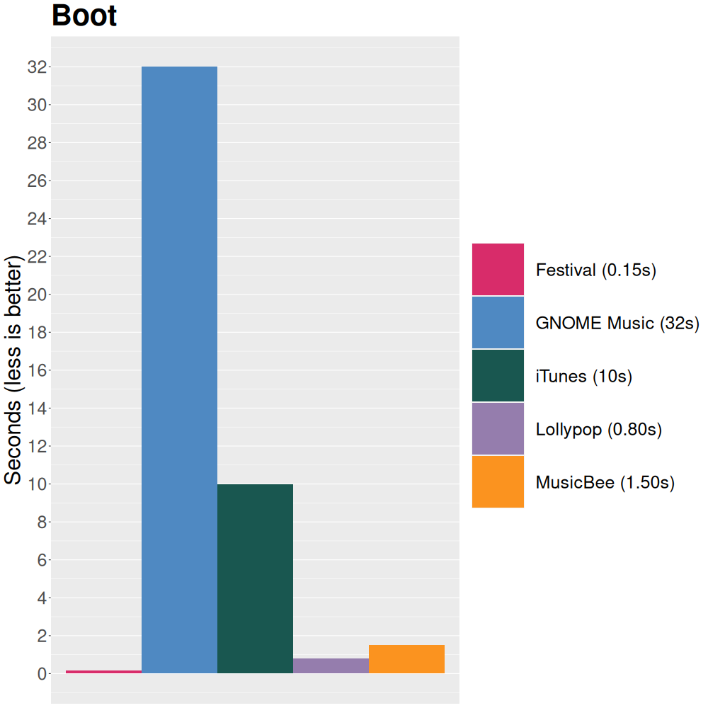

# Festival
Music player for Windows/macOS/Linux.


<br clear="left"/>

* [Comparison](#Comparison)
* [Documentation](#Documentation)
* [Frontends](#Frontends)
* [Build](#Build)
* [License](#License)

---

## Comparison
For context on these graphs (there are always trade-offs), see [`cmp/`](https://github.com/hinto-janai/festival/cmp).

Input data:

- 135 Artists
- 500 Albums
- 7000 Songs
- `170GB` total disk space







## Documentation
For a broad overview of `Festival`'s internals, see [`src/`](https://github.com/hinto-janai/festival/src).

## Frontends
The only frontend currently is `festival-gui`, which uses [`egui`](https://github.com/emilk/egui).

Other planned frontends:

| Frontend                    | Description |
|-----------------------------|-------------|
| `festival-web`              | `WASM` version of `egui` GUI
| `festivald`                 | Daemon ([`mpd`](https://github.com/MusicPlayerDaemon/MPD)-like)
| `festival-cli`              | CLI client that connects to `festivald`

Eventually, I'd also like to expose [`Festival`'s internals](https://github.com/hinto-janai/festival/src) as a library.

## Build
### General Info
You need [`cargo`](https://www.rust-lang.org/learn/get-started).

There are `30` unit tests, you may want to run:
```
cargo test
```
before attempting a full build.

---

### Linux
The pre-compiled Linux binaries are built on Debian 11, you'll need these packages to build:
```
sudo apt install build-essential cmake libgtk-3-dev
```

After that, run:
```
cargo build --release
```

---

### macOS
On macOS, if you want the binary to have an icon, you must install [`cargo-bundle`](https://github.com/burtonageo/cargo-bundle).

After that, run:
```
cargo bundle --release
```
This bundles `Festival` into `Festival.app`, the way it comes in the pre-built tars for macOS.

---

### Windows
```
cargo build --release
```

There is a `build.rs` file in the repo solely for Windows-specific things:

1. It sets the icon in `File Explorer`
2. It statically links `VCRUNTIME140.dll` (the binary will not be portable without this)

## License
`Festival` is licensed under the [MIT License](https://github.com/hinto-janai/festival/LICENSE).

All of the [fonts](https://github.com/hinto-janai/festival/assets/fonts) `Festival` uses:

| Font                                                                    | License |
|-------------------------------------------------------------------------|---------|
| [Adobe Source Code Pro](https://github.com/adobe-fonts/source-code-pro) | `OFL-1.1`
| [Adobe Source Han Sans](https://github.com/adobe-fonts/source-han-sans) | `OFL-1.1`
| [JuliaMono](https://github.com/cormullion/juliamono)                    | `OFL-1.1`
| [Emoji Icon Font](https://github.com/jslegers/emoji-icon-font)          | `MIT`
| [Noto-Emoji](https://github.com/googlefonts/noto-emoji)                 | `OFL-1.1`
| [Hack](https://github.com/source-foundry/Hack)                          | `MIT`
| [Ubuntu](https://github.com/daltonmaag/ubuntu)                          | `Ubuntu Font License`

All of the libraries `Festival` (directly) uses:

| Library | Purpose | License |
|---------|---------|---------|
| [anyhow](https://github.com/dtolnay/anyhow)                        | Error handling           | `MIT` & `Apache-2.0`
| [chrono](https://github.com/chronotope/chrono)                     | Time formatting          | `MIT` & `Apache-2.0`
| [clap](https://github.com/clap-rs/clap)                            | CLI arguments            | `MIT` & `Apache-2.0`
| [crossbeam_channel](https://github.com/crossbeam-rs/crossbeam)     | Thread message passing   | `MIT` & `Apache-2.0`
| [disk](https://github.com/hinto-janai/disk)                        | Saving to disk           | `MIT`
| [egui](https://github.com/emilk/egui)                              | GUI                      | `MIT` & `Apache-2.0`
| [egui_extras](https://github.com/emilk/egui/crates/egui_extras)    | GUI                      | `MIT` & `Apache-2.0`
| [eframe](https://github.com/emilk/egui/crates/eframe)              | GUI                      | `MIT` & `Apache-2.0`
| [egui-notify](https://github.com/ItsEthra/egui-notify)             | GUI                      | `MIT`
| [env_logger](https://github.com/rust-cli/env_logger)               | Logging                  | `MIT` & `Apache-2.0`
| [fast_image_resize](https://github.com/cykooz/fast_image_resize)   | Image processing         | `MIT` & `Apache-2.0`
| [image](https://github.com/image-rs/image)                         | Image processing         | `MIT`
| [infer](https://github.com/bojand/infer)                           | File MIME detection      | `MIT`
| [lazy_static](https://github.com/rust-lang-nursery/lazy-static.rs) | Lazy static macro        | `MIT` & `Apache-2.0`
| [lofty](https://github.com/Serial-ATA/lofty-rs)                    | Audio metadata parsing   | `MIT` & `Apache-2.0`
| [log](https://github.com/rust-lang/log)                            | Logging                  | `MIT` & `Apache-2.0`
| [notify](https://github.com/notify-rs/notify)                      | Filesystem watching      | `Artistic License 2.0` & `CC Zero 1.0`
| [mime_guess](https://github.com/abonander/mime_guess)              | File MIME detection      | `MIT`
| [rand](https://github.com/rust-random/rand)                        | RNG                      | `MIT` & `Apache-2.0`
| [rfd](https://github.com/PolyMeilex/rfd)                           | Native file dialog       | `MIT`
| [serde](https://github.com/serde-rs/serde)                         | (De)serialization        | `MIT` & `Apache-2.0`
| [serde_bytes](https://github.com/serde-rs/bytes)                   | (De)serialization        | `MIT` & `Apache-2.0`
| [souvlaki](https://github.com/Sinono3/souvlaki)                    | Native media controls    | `MIT`
| [strsim](https://github.com/dguo/strsim-rs)                        | String similarity        | `MIT`
| [strum](https://github.com/Peternator7/strum)                      | Enum iteration           | `MIT`
| [Symphonia](https://github.com/pdeljanov/Symphonia)                | Audio demuxing, decoding | `MPL-2.0`
| [readable](https://github.com/hinto-janai/readable)                | Human readable data      | `MIT`
| [rolock](https://github.com/hinto-janai/rolock)                    | Read only lock           | `MIT`
| [walkdir](https://github.com/BurntSushi/walkdir)                   | Recursive PATH walking   | `MIT` & `Unlicense` 
