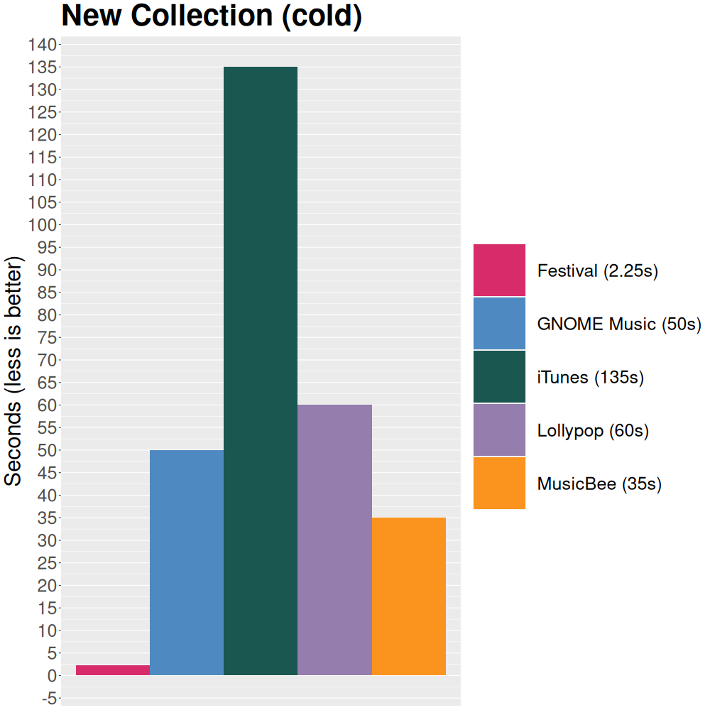
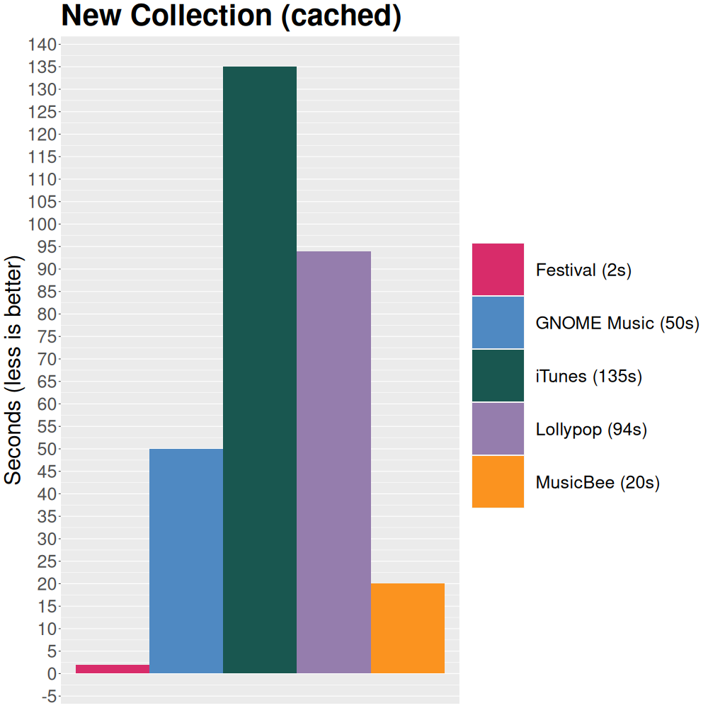
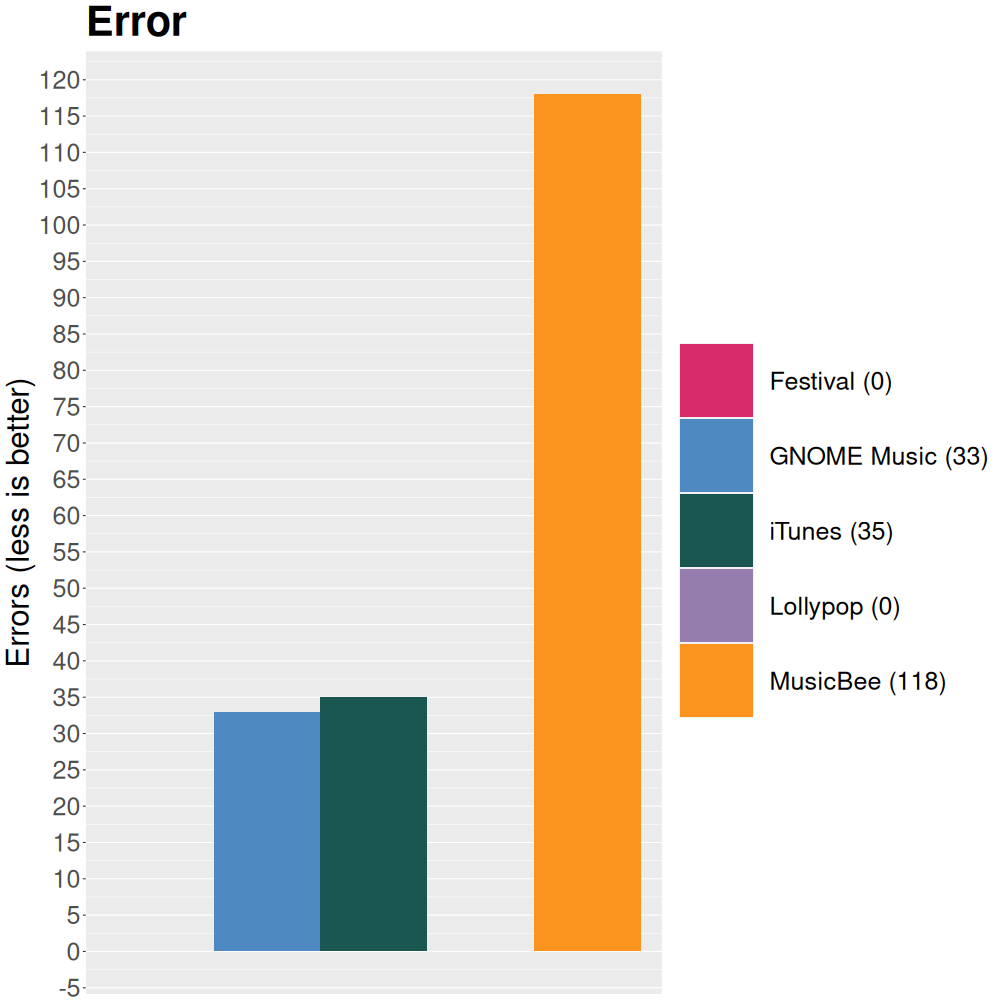
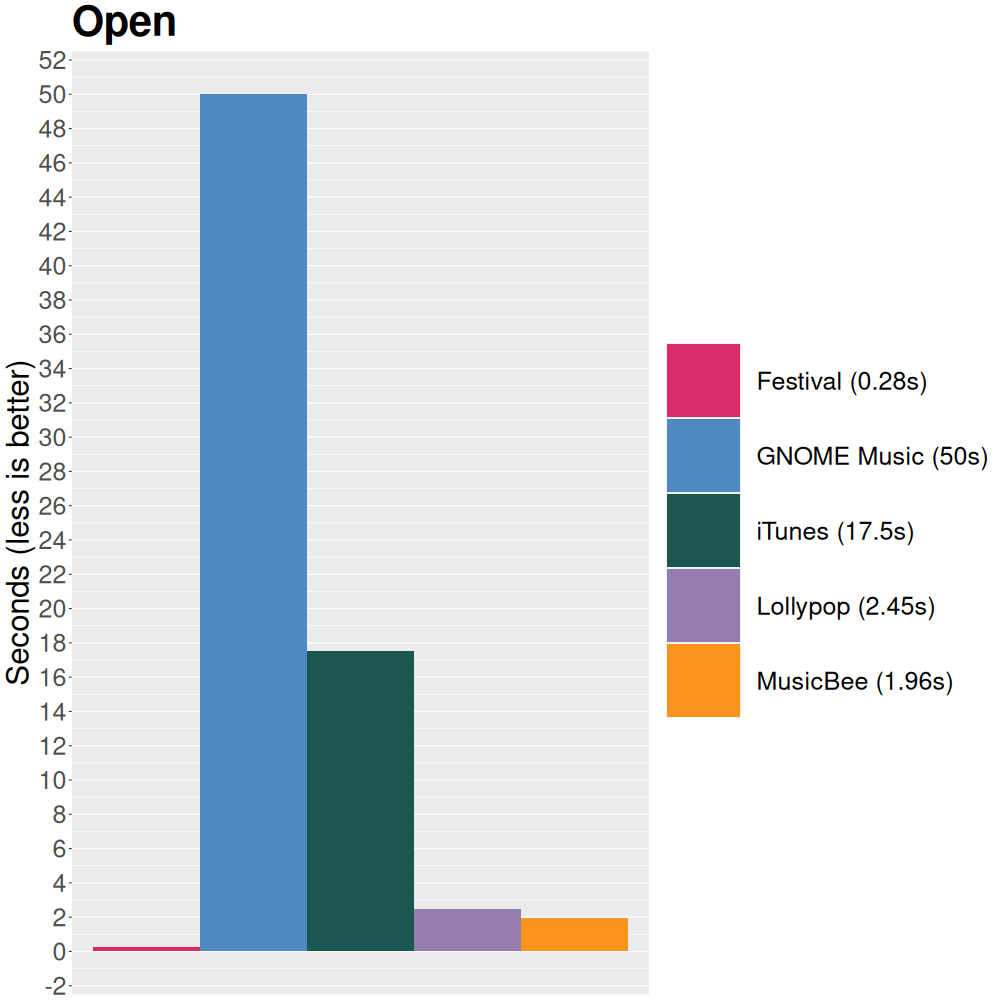

Some comparisons between `Festival` and other album centered music players.

The graphs are created with the code in this directory.

Big thanks to [Rucknium](https://github.com/rucknium) for teaching me `R`.

* [Comparison](#Comparison)
	- [Playlists](#Playlists)
	- [Sorting](#Sorting)
	- [Search](#Search)
	- [Features](#Features)
* [Testbench](#Testbench)
* [Data](#Data)
* [Tests](#Tests)
	- [New Collection (cold)](#New-Collection-cold)
	- [New Collection (cached)](#New-Collection-cached)
	- [Error](#Error)
	- [Open](#Open)
* [Why Festival Sucks](#why-festival-sucks)
* [Closing Notes](#Closing-Notes)

## Comparison
| Music Player | Version | OS | Open Source | Playlists | Sorting | Search | Features vs Minimal |
|--------------|---------|----|-------------|-----------|---------|--------|---------------------|
| [Festival](https://github.com/hinto-janai/festival)       | `1.0.0`                 | Windows, macOS, Linux | 🟢 | 🔴 | 🟢 | 🟢 | Minimal
| [Lollypop](https://gitlab.gnome.org/World/lollypop)       | `1.4.37` (2023-01-03)   | Linux (GTK)           | 🟢 | 🟡 | 🟡 | 🟡 | Both
| [GNOME Music](https://gitlab.gnome.org/GNOME/gnome-music) | `1.42` (2022-04-25)     | Linux (GTK)           | 🟢 | 🟡 | 🔴 | 🟡 | Minimal
| [MusicBee](https://www.getmusicbee.com)                   | `3.5.8447` (2023-02-19) | Windows               | 🔴 | 🟢 | 🟡 | 🟡 | Features
| [iTunes](https://www.apple.com/itunes)                    | `12.12.7` (2023-12-15)  | Windows               | 🔴 | 🟢 | 🟡 | 🔴 | Features

#### Playlists
Playlist handling: What happens when you delete the underlying file of a song in an existing playlist? Or worse, reset the whole Collection?

| Music Player                 | Behavior |
|------------------------------|----------|
| `Festival`                   | Playlists are not supported
| `Lollypop` and `GNOME Music` | Silently adds/removes songs from playlists if the underlying file gets added/deleted
| `MusicBee` and `iTunes`      | Continues displaying the playlist with the correct metadata, shows error when attempting to play missing song

I believe `MusicBee` and `iTunes` have the best approach here. If/when `Festival` gets playlist support, their approach will probably be used.

#### Sorting
"Sorting methods" refers to how many options the music player provides to sort the music, either by artist, album, song, or a cross-sort combining them, e.g: album covers by artist name and album release:
```
a_artist
    |_ 2020_album
    |_ 2021_album

b_artist
	|_ 1980_album
	|_ 2000_album

[...]
```
This also accounts for how painful it is to switch the sorting methods, e.g, it'll cause all albums art to be reloaded, it takes a while, it freezes, etc.

Festival has _many_ sorting methods and switching is instantaneous due to it being very lightweight to do so internally (sorting method is just an `enum` that gets `match`'ed to an already existing `Vec<usize>` representing `Song` indices in the already existing `Collection`, basically we just use a different field in a struct we already have).

#### Search
"Search" refers to how quick and how accurate the search functionality is.

All of the listed music players can search for `Artist` names, `Album` titles, and `Song` titles.

- Festival: accurate, no delay
- GNOME Music: accurate, slightly slower
- Lollypop: accurate, slower
- MusicBee: a little less accurate, but slightly faster than GNOME Music
- iTunes: accurate, good UI, but has an _enormous_ amount of lag any time a key is inputted, making it unusable

#### Features
"Features vs Minimal" refers to if the music player is packed with (useful) features or if it's just a minimal music player.

Features could be things like:

- Searching
- Re-encoding
- Metadata editing
- etc.

## Testbench
The tests were conducted on the following PC:

| Component | Spec |
|-----------|------|
| CPU       | AMD Ryzen 5950x (32 threads)
| RAM       | 2x32GB DDR4 3800MHz
| SSD       | 500GB Samsung Evo 850 (540MB/s sequential reads)
| OS        | `Windows 10` and `Arch Linux (2023-06-24)`

Some things to keep in mind:

- Linux was used for `Festival`, `Lollypop` and `GNOME Music`
- Windows was used for `MusicBee` and `iTunes`
- `ext4` filesystem was used for `Festival`, `Lollypop`, and `GNOME Music`
- `NTFS` filesystem was used for `MusicBee`, `iTunes`
- `FLAC` files were converted to smaller sized `ALAC/AAC/MP3` for iTunes since it does not support FLAC (...!)

## Data
The tests were tested on a music collection consisting of:

- 172 Artists
- 725 Albums
- 7453 Songs
- 78% `FLAC`
- 14% `MP3/MPEG`
- 7% `OGG/WAV/AAC`
- 1% `ALAC/M4A`

Totaling to `257GB` of disk space.

The average album art size is around `5MB`, with an average resolution of around `1600x1600`.

## Tests
### New Collection (cold)
Right after a fresh system boot, with no system or application cache, how long does it take to create a new Collection and render all the album art?



| Music Player  | Seconds (less is better) |
|---------------|--------------------------|
| Festival      | 4.5
| MusicBee      | 35
| GNOME Music   | 50
| Lollypop      | 60
| iTunes        | 135

### New Collection (cached)
Both the system's cache and the application's cache itself (`~/.cache`) can drastically speed things up.

Right after the previous cold boot Collection creation, how long does it take to remove the first Collection, create it again, and then render all the album art?



| Music Player  | Seconds (less is better) |
|---------------|--------------------------|
| Festival      | 2
| MusicBee      | 21
| Lollypop      | 94
| GNOME Music   | 50
| iTunes        | 135

Notes:

- `Festival` doesn't cache files, but it benefits a lot from system cache (particularly from walking directories that were indexed by the system already)
- Although the creation of the new Collection is relatively fast, `Lollypop` suffers a lot from having to remove everything from the current database beforehand
- Both `Lollypop` and `MusicBee` cache files and also benefit from system cache
- Both `GNOME Music` and `iTunes` don't benefit at all even though they cache files

### Error
After creating a Collection, how many albums are not processed correctly? Missing metadata, missing album art, duplicate albums, etc.



| Music Player  | Errors (less is better) |
|---------------|-------------------------|
| Festival      | 0
| Lollypop      | 0
| GNOME Music   | 33
| iTunes        | 35
| MusicBee      | 118

### Open
When opening the music player, how long does it take to render all the album art?



| Music Player  | Seconds (less is better) |
|---------------|--------------------------|
| Festival      | 0.28
| Lollypop      | 2.45
| MusicBee      | 1.96
| iTunes        | 17.5
| GNOME Music   | 50

## Why Festival Sucks
After paragraph and paragraph of basically gloating, it only makes sense to point out _some_ of the _many_ flaws in Festival.

In no particular order:

- Doesn't support basic playlists
- Doesn't support compilations
- Doesn't support incrementally adding songs/albums
- Limited playback options (weird shuffle, no gain, etc)
- Uses an **insane** amount of memory during Collection creation relative to the other music players (2x-3x more...!)
- UI could be prettier

The charts are also quite unfair to the other music players, because it is measuring a function (resetting the _entire_ Collection) that isn't necessarily supposed to be used often. Other than Festival, all the other music players support dynamically adding/removing songs and albums, so there is usually no need to reset the whole thing.

In order to achieve the speeds that it does, Festival sacrifices everything in terms of dynamic Collection management, since after the initial creation of the Collection, it is immutable _forever_. This doesn't make implementing dynamic data inside it or on top of it (playlists) impossible, [but it makes it very annoying due to index invalidation](https://github.com/hinto-janai/festival/issues/4).

This means whenever a new song needs to be added/removed, [Festival _must_ reset the entire Collection](https://github.com/hinto-janai/festival/issues/2). So it being fast is not a nice to have, it's basically required.

Festival ignores some metadata tags as well (because I don't personally use them).

Some maybe important ones:

- Genre
- Lyrics
- Composer
- Conductor
- Ensemble
- Movement
- Location
- Grouping
- Comment
- Label
- MusicBrainz_*

## Closing Notes
Some other big differences that aren't shown in graphs here:

- GUI bugs (`GNOME Music`, `MusicBee`, and `iTunes` all have terrible GUI bugs)
- Album art size (`Festival` uses `500x500` internally, others use `300x300` or similar)
- Access times (`Vec` index vs `SQL` query)

I modeled a lot of Festival's UI and behavior after [`Lollypop`](https://gitlab.gnome.org/World/lollypop), because it is:

- Correct (no metadata errors)
- Relatively bug-free
- Relatively minimal
- Relatively fast
- Pretty

There are some bugs (resetting Collection _always_ needs a restart since it does not load properly), some extra features I'll never use (internet related stuff), and some features I wish it had (album art bigger than `300x300`), but nothing else really comes close to it.

As this project grew in scope, I realized separating Festival's internals from the GUI would result in a re-usable base for multiple different frontends. This is mostly the reason why I made Festival when Lollypop already existed. Also, I wanted to practice Rust.
