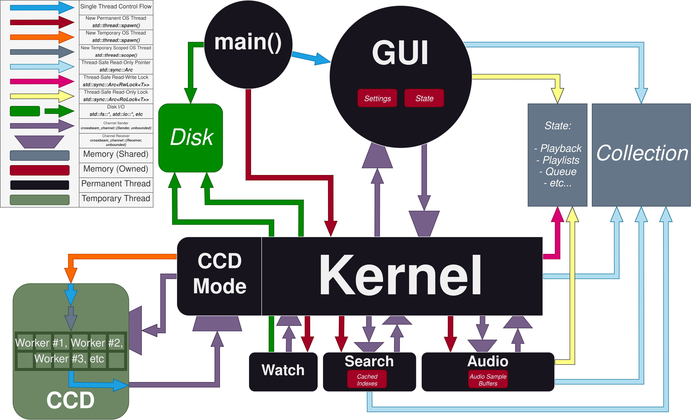
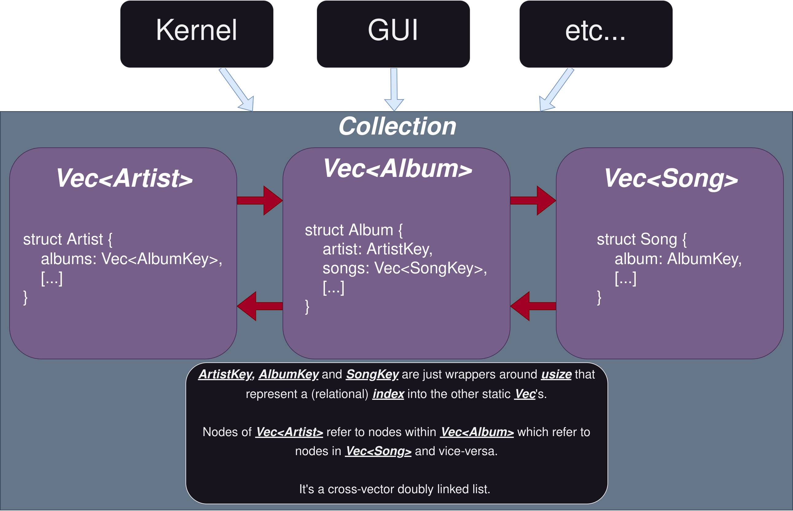
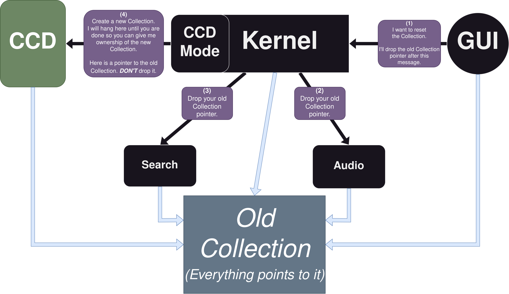
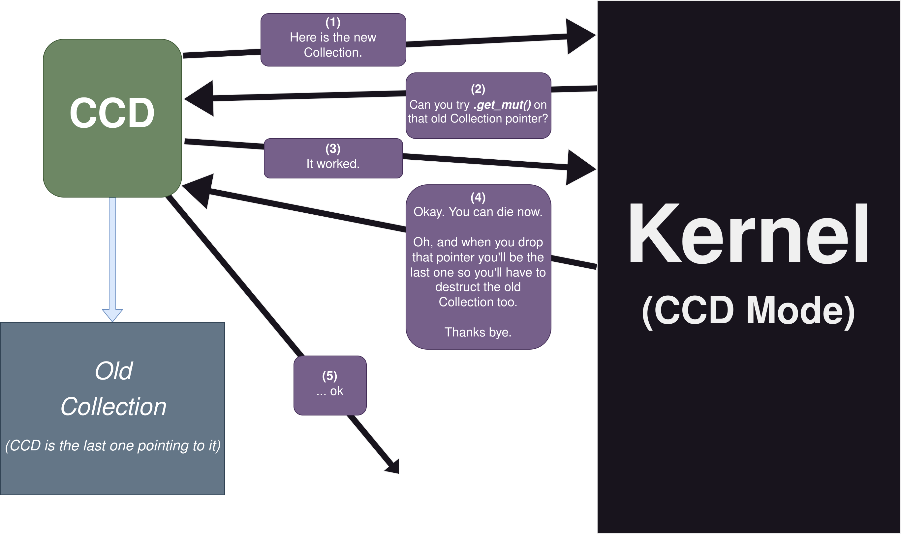
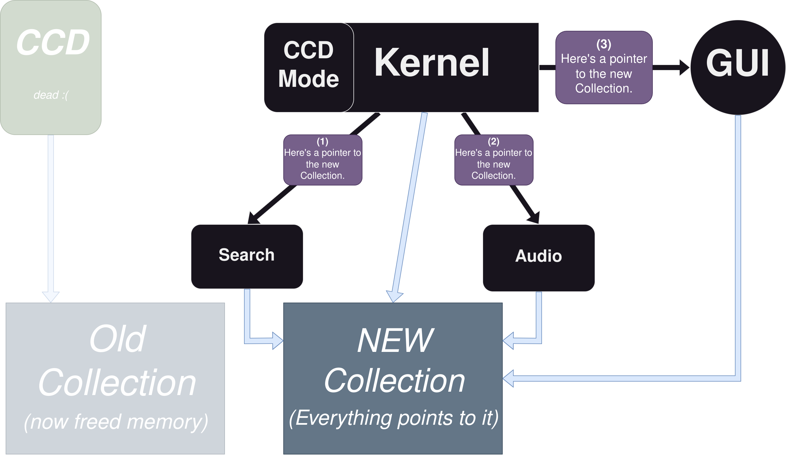
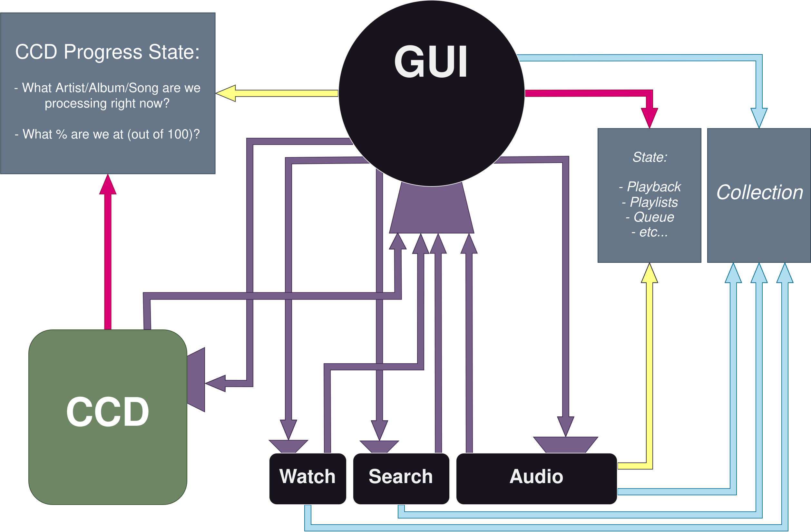
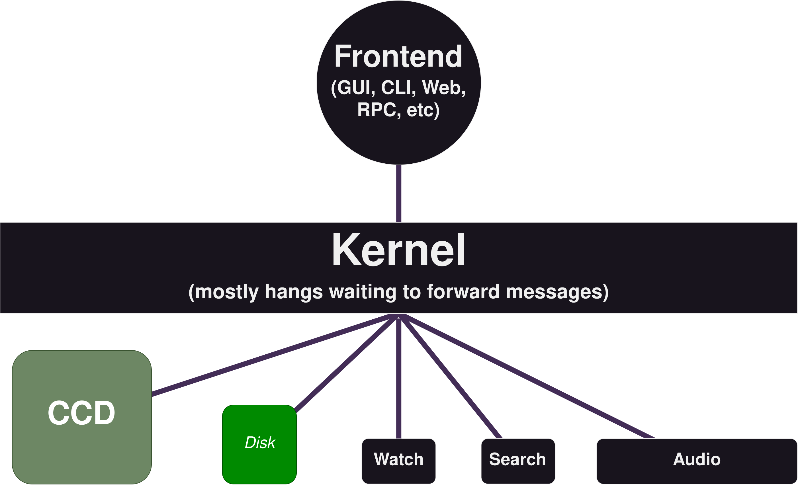

# `shukusai` documentation
This is an overview of `Festival`'s internals: `shukusai`.

For details on any part of the system, look within any given sub-directory for its `README.md`, which contains more specific documentation.

The code itself is also littered with comments. Some `grep`-able keywords:

| Word        | Meaning |
|-------------|---------|
| `INVARIANT` | This code makes an _assumption_ that must be upheld for correctness
| `SAFETY`    | This `unsafe` code is okay, for `x,y,z` reasons
| `FIXME`     | This code works but isn't ideal
| `HACK`      | This code is a brittle workaround
| `PERF`      | This code is weird for performance reasons
| `TODO`      | This has to be implemented
| `SOMEDAY`   | This should be implemented... someday

---

The crate [`festival`](https://crates.io/crates/festival) is being squatted, so instead, Festival's
original name, [`shukusai`](https://crates.io/crates/shukusai), is the name used to represent the internals.

`祝祭/shukusai` translated means: `Festival`.

In documentation:

- `shukusai` _specifically_ means `Festival`'s internals
- `Festival` means a frontend OR the project as a whole

---

* [Code Structure](#Code-Structure)
	- [Data](#Data)
	- [Threads](#Threads)
	- [Misc](#Misc)
* [Overview](#Overview)
	- [Collection](#Collection)
	- [Kernel](#Kernel)
	- [CCD](#CCD)
	- [Watch](#Watch)
	- [Search](#Search)
	- [Audio](#Audio)
	- [GUI](#GUI)
* [Collection](#Collection-1)
	- [The 3 Vecs](#The-3-Vecs)
	- [Keys](#Keys)
	- [Keychains and Slices](#Keychains-and-Slices)
	- [Construction and Destruction](#Construction-and-Destruction)
	- [Lifetime](#Lifetime)
	- [Mutation](#Mutation)
	- [File Format](#File-Format)
	- [HashMap vs Pointer vs Index](#HashMap-vs-Pointer-vs-Index)
* [Modularity](#Modularity)
	- [Why Kernel?](#Why-Kernel)
	- [Cons](#Cons)
	- [Pros](#Pros)
* [Disk](#Disk)
	- [Collection](#Collection-2)
	- [Settings](#Settings)
	- [State](#State)
* [Personal Libraries](#Personal-Libraries)
	- [Disk](#Disk)
	- [Readable](#Readable)
	- [RoLock](#RoLock)
* [External Libraries](#External-Libraries)
* [Audio Codecs](#Audio-Codecs)
* [Image Formats](#Image-Formats)
* [Alternative Frontends](#Alternative-Frontends)

---

# Code Structure
The structure of the folders & files located in `src/`.

## Data
These folders represent data:

| Folder         | Purpose |
|----------------|---------|
| `collection/`  | Data for `Collection` and everything `Collection`-related
| `key/`         | `Key`'s for indexing the `Collection` in a type-safe way
| `slice/`       | `Queue` and `Playlists` (the same thing, slices)
| `sort/`        | Various sorting methods on the `Collection`

## Threads
These folders represent OS threads with a distinct purpose:

| Folder           | Purpose |
|------------------|---------|
| `audio/`         | Audio demuxing + decoding + playback thread
| `ccd/`           | CCD thread (Collection Constructor Destructor)
| `kernel/`        | Coordinates all threads and resources
| `search/`        | Search thread (searches the `Collection` with arbitrary input)
| `watch/`         | Watch thread (watching for user CLI commands)

## Frontends
These folders represent the frontend threads. They are located at the root `/`.

| Folder           | Purpose |
|------------------|---------|
| `festival-gui/`  | GUI thread (egui)
| `festival-web/`  | WASM thread (egui)
| `festivald/`     | Daemon thread
| `festival-cli/`  | CLI client

## Misc
These are top-level `src/` files for miscellaneous stuff:

| File           | Purpose |
|----------------|---------|
| `constants.rs` | General constants
| `logger.rs`    | Console logging initialization
| `lib.rs`       | `pub` re-exposing, `doc` comments
| `panic.rs`     | Custom panic hook

# Overview
<div align="center">

The relationship between the main threads and data. Threads communicate via `crossbeam::channels`.



A simplified explanation of what happens at `main()`:

(although, reading `main.rs` might be easier, it's only `30` lines long)

1. User opens `Festival`
2. CLI arguments are handled
3. `Kernel` <-> `GUI` channels created
4. `Kernel` is spawned, given channel
5. `Kernel` spawns everyone else, starts a bunch of stuff
6. `main()` directly turns into `GUI`, taking the other end of the channel

</div>

## Collection
This is the core data structure that holds the user's entire music _collection_.

`Artist`'s, `Album`'s, `Song`'s, art, metadata, relational data, it's all here.

The actual _audio data_ is not stored, rather a `PATH` to where that particular `Song` can be found is saved, album art bytes on the other hand _is_ saved (after being resized).

`Collection`'s lifetime is as long as `Festival` is open, or until a reset is requested.

After initial creation, `Collection` is permanently wrapped in an `Arc` such that all threads can have fast access to it while disallowing any mutation.

## Kernel
`Kernel` is the coordinator for all other threads. If ownership of any long-lived data is required, `Kernel` is most likely the one to have it. Mutable access to shared data is also restricted to `Kernel`. When any thread needs to mutate something (or really do anything), they usually need to go through `Kernel` first.

_Most_ threads in the system only have one `Sender/Receiver` channel pair, all sending/receiving to & from `Kernel`. Although, `Kernel` is the exception, it has channels to send and receive from _all_ threads.

The main reasons `Kernel` exists:

1. To provide a **small** and **single** interface to other threads
2. Ease communication between threads (reduce blocking calls)
3. Manage resources, and in general be "the one in control"

## CCD
This is temporary thread that gets spun up by `Kernel` for either:

a. Creating a new `Collection` from scratch
b. Converting an already existing `Collection`'s images

 All the functions related to the actual _construction_ of the `Collection` belong to `CCD` (found in its folder `ccd/`). `CCD` itself spins up even more threads under its own control (`worker` threads) to process data in parallel.

At the end of option `a)`, `CCD` is given its final task in life: to `drop()` the old `Collection`.

Since dropping a potentially large recursive object like `Collection` might take a while, it shouldn't be done in the `GUI` thread. Best case, a couple frames are skipped, worst case, it freezes for a few seconds. `Kernel` could handle dropping it, but then it would take that much more time to return.

Since we have a perfectly good thread (`CCD`) on its way out anyway... why not give it the (slightly cruel) final job of _deconstruction_, since it won't block anyone?

Thus, `CCD` is the **Collection Constructor Destructor.**

## Watch
`Watch` watches the filesystem (local data folder, e.g.: `~/.local/share/festival/signal`) for file-based signals.

Instead of implementing UNIX sockets and Windows named pipes, or [using](https://github.com/servo/ipc-channel) a [dependency](https://github.com/kotauskas/interprocess), regular files are used to indicate the simple boolean signals needed by the `Watch` thread.

For example:

- Play
- Pause
- Next
- etc...

This command:
```bash
./festival --play
```
just creates a file called `play` within `~/.local/share/festival/signal/`, which `Watch` promptly deletes after sending a message to `Kernel` saying that the user requested `Play`.

The command:
```bash
touch ~/.local/share/festival/signal/play
```
is equivalent.

`Watch` never reads the data of the file itself since the file itself existing represents `true`.

The filesystem watching functionality is provided by [`notify`](https://github.com/notify-rs/notify).

## Search
`Search` sleeps waiting for arbitrary `String` inputs from `Kernel` and searches the `Collection` with it.

`Search` returns sorted `Artist`'s, `Album`'s, and `Song`'s that go from most similar, to least similar to the input.

A `HashMap` of already inputted `String`'s and sorted results are kept around by `Search` to act as a cache.

The algorithm used is a string-similarity comparison provided by [strsim](https://docs.rs/strsim), specifically the `jaro` variant.

## Audio
`Audio` is responsible for the continuous demuxing and decoding of a given audio file.

It also writes that data to the audio hardware so that it can be played.

This is provided by [`Symphonia`](https://github.com/pdeljanov/Symphonia).

`Audio` also sends/receives messages from `Kernel`, e.g: play/pause, adjust volume, etc.

## GUI
`GUI` is the thread that runs... the GUI.

Just like the other threads, `GUI` doesn't control much, it just sends/receives messages from `Kernel`.

`GUI` really just is a frontend to visualize the `Collection` itself. Since the `Collection` is wrapped in an `Arc` for all its lifetime, the `GUI` thread has (very fast) access to all of its contents, but cannot mutate it.

Instead, if `GUI` (really, the user) clicks a particular song, really what is happening is that `GUI` sends a message to `Kernel` detailing exactly what `Song` should be played, added to the queue, removed from a playlist, etc.

There are `State/Settings` that `GUI` holds ownership over and can mutate for itself, e.g: sorting method, art size, etc, but those will be dependent on the frontend implementation itself rather than everything else in the system.

The GUI library currently used is [`egui`](https://github.com/emilk/egui).

The term `GUI` in the documentation can apply to any other frontend (`web`, `daemon`, `cli`).

# Collection
The core "database" that holds all the (meta)data about the user's music.

This would normally be an _actual_ database like `SQLite`, `Postgres`, `LMDB`, etc, but `shukusai` just uses a regular old `struct` made up of `Vec`'s and a few other `std` types. The entire `Collection` is in-memory at all times.

The main reasons why this is done:

- Performance
- `std` types instead of `C` bindings
- Access to all `Vec` methods (`albums.iter()`) and indexing (`albums[88]`)
- Metadata is static (there's _always_ an artist, track length, song title, etc). This makes a "hand-crafted" database less insane than it sounds since the _type_ of data is known at compile time (song title lengths will vary, but there _will_ be a title).
- I'm stupid and this was the first idea I thought of when considering how `egui` would (cheaply) draw all the album art

Here's an abbreviated version of what `Collection` actually looks like:
```rust
struct Collection {
	artists: Vec<Artist>,
	albums: Vec<Album>,
	songs: Vec<Song>,

	sorted_artists: Vec<ArtistKey>,
	sorted_albums: Vec<AlbumKey>,
	sorted_songs: Vec<SongKey>,

	[...]
}
```

## The 3 Vecs
The three main `Vec`'s that the `Collection` is made up of are:

1. `Vec<Artist>`
2. `Vec<Album>`
3. `Vec<Song>`

These 3 are completely separate and contain relatively scoped data.

Pros of having completely separate `Vec`'s:

- Processing a _specific_ type of data is much easier, e.g: only iterating over `Album`'s
- Lots of operations only need `Song` data and `collection.songs[0].title` is much prettier than `collection.artists[92].albums[3].songs[0].title`
- Indices refer to an "absolute" index, e.g: `collection.songs[0]` is the 1st song in the `Vec` containing ***all songs***, whereas in the nested version, it would be the 1st song within some particular `Album` belonging to some particular `Artist`.
- Multiple flat data structures are easier to reason about than their nested counterparts

Cons:

- All relational data is lost (embedding `Song` within `Album` within `Artist` "automatically" links them)
- Using indices instead of text keys means playlists/queues are connected with a _particular_ `Collection` and cannot be transferred

## Keys
`Key`'s are just simple wrappers around a `usize`, literally defined like so:
```rust
struct ArtistKey(usize);
struct AlbumKey(usize);
struct SongKey(usize);
```
This is 100% just for compile-time type safety.

When indexing `Vec<Artist>`, you really want to make sure you have a `usize` corresponding to `Vec<Artist>`, so instead of raw indexing like so:
```rust
let my_usize = get_index();
//  ^
//  |_ not necessarily clear which `Vec` this is for.

collection.artists[my_usize]; // Compiles, works.
collection.albums[my_usize];  // Compiles, maybe will `panic!()`
collection.songs[my_usize];   // Compiles, maybe will `panic!()`
```
Having this `Key` type makes what thing we're looking for _explicit_:
```rust
let key = ArtistKey::from(0);

collection.artist(key); // We get artist[0].
collection.song(key);   // Compile error!
```

In terms of overhead, all the functions are inlined. Just to make sure though, I checked the assembly. It's optimized away with both index operations resulting in the same instructions:
```
mov [...]
lea [...]
```
Thanks compiler.

_Note: it's still 100% possible to do `collection.artists[my_usize]` or create a `Key` from an incorrect index so I'm still "trusting" myself here (although less so than tossing usizes around). If I ever make `shukusai`'s API public, the `Vec`'s will be wrapped so this isn't possible._

<div align="center">

The problem of relational data being lost between the 3 `Vec`'s is solved by embedding the related `Key`'s within the `Artist/Album/Song` structs:



</div>

This is essentially a doubly-linked-list, but across vectors. Since the `Collection` is _static_ for its entire lifetime, we also get to use indices instead of pointers, meaning `artist[0]` will always `== artist[0]` and that saving to disk is possible (it's just a `usize`).

This relational-link only needs to be done once, when the `Collection` is initially created, where-after, when given _any_ `Song`, you can traverse to the `Album`, and then to the `Artist` or vice-versa.

## Keychains and Slices
There are situations where you want multiple `Key`'s.

The primitive building block made from an `ArtistKey`, `AlbumKey`, and `SongKey` is the `Key`, defined as:
```rust
struct Key(ArtistKey, AlbumKey, SongKey);
```
You could consider this an _absolute_ key to a specific `Song` within a specific `Album` owned by a specific `Artist`.

When multiple `Key`'s are needed, but keeping them separate is desired, there is `Keychain`:
```rust
struct Keychain {
	artists: Vec<ArtistKey>,
	albums: Vec<AlbumKey>,
	songs: Vec<SongKey>,
}
```

When you _do_ want them linked together, there is `Slice`, which is like an actual Rust `slice`. It's a dynamically-sized view into a contiguous sequence:
```rust
struct Slice(VecDeque<Key>);
```
This is the structure the song queue and user playlists are made out of (which are the same thing, really).

## Construction and Destruction

The linking and creation of the `Collection` itself is done by the `Collection Constructor Destructor`, or, `CCD`.

The "create a new `Collection`" process, simplified:

1. User requests a new `Collection`
2. `Kernel` spawns `CCD`
3. `CCD` creates the new `Collection`
4. `CCD` sends the new `Collection` to `Kernel`
5. `Kernel` sends a pointer to the new `Collection` to all threads
6. `CCD` saves the new `Collection` to disk, deconstructs the old `Collection`, and dies

<div align="center">

The request for a new `Collection` always comes from the user (GUI, in this diagram).

After sending the `PATH`'s it wants scanned to `Kernel`, `GUI` drops its pointer to the old `Collection`.

`Kernel` then tells everyone to drop their old pointers, and goes into "CCD" mode, spawning `CCD`, giving it an _old_ pointer and _only_ listening to it.



After `CCD` finishes, it hands ownership of the new `Collection` over to `Kernel`, after which `Kernel` drops its pointer to the _old_ `Collection`, leaving `CCD` the last one with a pointer to it.

`Kernel` now tells `CCD` to "die", and closes the channel.

`CCD`, being the last one holding onto an `Arc` to the _old_ `Collection`, will be the one actually _deconstructing_ the underlying memory. This role is given to `CCD` as:

1. Dropping a potentially heavy & recursive object could take a while (bad idea for `GUI`)
2. `CCD` is already on its way out, so why not let it take out the garbage too



In the meanwhile, `Kernel` is sending signals to all the main threads, giving them pointers to the _new_ `Collection`, effectively ending this "new `Collection`" process.



</div>

## Lifetime
`Collection` gets created _once_, (its core data) never gets mutated, and lives in memory as long as `Festival` is open or until the user requests a new one.

To prevent invalidating all the indices to the inner `Vec`'s, `Collection` _must_ be static.

This unfortunately means the lifetime of user-created playlists are tied with the `Collection`.

Since playlists are just `Slice`'s, they will be invalidated if indices are changed.

This can be fixed by:

1. Storing `Artist`, `Album` and `Song` names by text
2. Comparing those with the new files when the user creates a new `Collection`
3. Connect the known names with the new indices
4. Do ??? with names that don't exist anymore

This isn't implemented because I personally never use playlists (it would be a lot of work, too).

Pretty much all collection/library-based music players (iTunes, MusicBee, Lollypop) have dynamic databases, meaning, inserting and removing songs/albums is no problem.

Since in `Collection`, that would end up invalidating everything, mutation is not possible, instead a _whole new_ `Collection` must be made from scratch.

The one and only saving grace for what otherwise is bad code:

- **It's fast.**

The time it takes `Lollypop` to add 1 new song and reload is the same time it takes `Festival` to create [an entire `Collection` consisting of 135 `Artist`'s, 500 `Album`'s, and 7000 `Song`'s from scratch.](https://github.com/hinto-janai/festival/tree/main/cmp)

Not to mention the access times of indexing a `Vec` vs `SQL` queries.

## Mutation
After `CCD` hands off the finished `Collection` to `Kernel`, `Kernel` wraps it in an `Arc` and it becomes immutable from that point.

**Although, mutation does occur at a single point:** when `Festival` starts up, `Collection` is read from disk, and the `Album` art is converted from `Vec<u8>` into `egui` images. Other than this, the core data is _never_ touched. The reason why this isn't handled by `serde` and immediately wrapped into an `Arc` is because that image conversion has been customized to use multiple threads.

## File Format
[`Bincode`](https://github.com/bincode-org/bincode) is used to save the `Collection` and its related data structures (`Queue`, `Playlist`) to disk.

[`TOML`](https://github.com/ordian/toml_edit) is used for miscellaneous state, like the `GUI` settings.

`shukusai` uses the library `disk` that adds some extra features to `Bincode` files. In particular, it adds a versioning system.

This is for when I eventually realize the `Collection` has a mistake in it's structure, or that something should be changed.

Having a versioning system allows for backwards compatibility, and also could allow for different "types" of `Collection`'s based off the use-case, for example: `Daemon + CLI Client` would not need album art, so that could be removed which would save a lot of processing time and disk space.

The versioning system is quite simple, `25` bytes of data are just added to the front of the file before saving.

The first `24` bytes are a unique header. This is to make sure the following byte representing the version _is_ the version byte:
```rust
// The 24 unique bytes our Bincode files will start with.
// It is the UTF-8 encoded string "-----BEGIN FESTIVAL-----" as bytes.
// The next byte _should_ be our version, then our actual data.
const FESTIVAL_HEADER: [u8; 24] = [
    45, 45, 45, 45, 45,             // -----
    66, 69, 71, 73, 78,             // BEGIN
    32,                             //
    70, 69, 83, 84, 73, 86, 65, 76, // FESTIVAL
    45, 45, 45, 45, 45              // -----
];
```
The next byte is the version, represented by a `u8`, meaning it has `0-255` different possible values:
```rust
// Current major version of the `Collection`.
const COLLECTION_VERSION: u8 = 1;
```
After this, the rest of the bytes should be the `Collection` in binary form.

Currently, album art is represented in the `Collection` as `Option<Vec<u8>>` (RBG format), which gets transformed into images the frontend can actually display at runtime. The current GUI is `egui`, so it gets turned into `egui_extras::RetainedImage`. This will obviously change as different frontends are made.

## HashMap vs Pointer vs Index
Since I didn't want to use a real database, there were 3 possible `std`-based setups I thought of:

---

Option 1 - Nested `HashMap`:
```rust
struct Collection(HashMap<Artist, HashMap<Album, HashMap<Song>>>);
```
Pros:

- Relatively fast
- Easy access with `String` keys
- Relational data is "automatic"
- Queue/Playlists would be _so easy_ to handle
- All `HashMap` methods are available to use

Cons:

- Not possible to sort directly
- No sequential iteration, `HashMap` key-value pairs are in random order
- Nested data structures make my brain hurt
- Nested data structures makes code long (`collection.get("artist").unwrap().get("album").unwrap().get("song").unwrap()`)

---

Option 2 - Separate `Vec`'s with connecting smart pointers:
```rust
struct Collection {
	artists: Vec<Arc<Artist>>,
	albums: Vec<Arc<Album>>,
	songs: Vec<Arc<Song>>,
}

struct Artist {
	albums: Vec<Arc<Album>>,

	[...]
}
```
Pros:

- Very fast
- Moving the elements in the `Vec` (e.g, sorting) doesn't cause invalidation, pointers _always_ point to the same object
- Dynamic data is also easier since invalidation isn't a concern
- Can sort cloned `Arc`'s based off the objects instead of the objects themselves
- Sorted iteration is extremely easy (`collection.albums.iter()`)
- All `Vec` methods are available to use

Cons:

- Cannot save to disk (linking has to be done at startup _everytime_)
- Hard to read, especially if mutability is desired (`Vec<Arc<RwLock<Artist>>>`)

---

Option 3 - Separate `Vec`'s with connecting `usize` indices, wrapped in `Arc`:
```rust
struct Collection {
	artists: Vec<Artist>,
	albums: Vec<Album>,
	songs: Vec<Song>,
}

struct Artist {
	albums: Vec<usize>,

	[...]
}

let collection: Arc<Collection> = [...];
```
Pros:

- **Extremely fast**
- Indices will _always_ point to the same object (`artist[0]` will always `== artist[0]`)
- Saving to disk is as easy as saving the `usize`
- Can sort the `usize` based off the objects instead of the objects themselves
- Sorted iteration is extremely easy (`collection.albums.iter()`)
- All `Vec` methods are available to use

Cons:

- Mutating the `Vec`'s after creation is not allowed, will result in index invalidation
- The lifetime of any dynamic data built-on top of this is also tied to it (`Playlists`)

This is the option I chose.

# Modularity
`shukusai` is more or less separated into "entities". Each "entity" in the system is its own thing, and only passes messages to/from `Kernel`. This approach was taken because:

- Unit testing is easier
- Plugging in different frontends becomes much easier
- Separating the different parts of the system and giving them names is easier to reason about than one single `shukusai` blob. The scope of what any specific code is doing becomes smaller; less variables to keep in mind when reading code.

## Why Kernel?
`Kernel` doesn't actually do much, it mostly just forwards messages. 

But the existence of `Kernel` allows the other parts of the system to have a _single, simple_ interface.

Consider the following diagram showing `shukusai` if `Kernel` didn't exist:



`GUI` (and every frontend that gets made) would need to implement interface code for all parts of the system.

Reversely, the other parts of the system would also need to have a public API that suits `x` frontend.

Instead of that, `Kernel` acts as the middleman, so that _all_ threads go through it, and that all this "interface" logic is encapsulated:



Each thread communicates with `Kernel` and `Kernel` only, sending well-defined messages. This is literally the message implementation between `CCD` and `Kernel`:
```rust
enum CcdToKernel {
    NewCollection(Collection),
    Failed(anyhow::Error),
    Update(String),
}

enum KernelToCcd {
	Die,
}
```
If _all_ messages were sent/received from `GUI`:

- The enum base size would be space inefficient
- The `match` statements would be pages long
- Any other part of the system could "fake" send messages from other parts of the system (`Audio` could send `CCD` messages)

The channel between `Kernel` and every part of the system is _unique_ and only the proper thread can send them.
```rust
let (tx, rx) = crossbeam::channel::unbounded::<CcdToKernel>();
```
That channel only gets passed to `CCD` and `Kernel`, meaning `Audio` or other threads _cannot_ "fake" send messages:
```rust
audio_to_kernel.send(CcdToKernel::Update("fake msg"));
//                   ^
//                   |
//             Compile error!
```

These unrealistic type errors don't matter too much since after all, _I_ am the one writing the code, but this may matter if `shukusai` ever get exposed as a public API.

Also, it's always a nice feeling to have the type checker behind your back. This same idea applies to using `Key` instead of a raw `usize` for `Collection` indexing.

## Cons

- There technically is a performance cost, albeit _tiny_. Any message passing will be slower than having _all_ variables in scope in a single thread (highly unrealistic spaghetti code)

## Pros

- More modular, different components can be swapped more easily
- Cleaner, separated, and more well defined code
- Using the word `Kernel` is cool

# Disk
Specification of what and where `shukusai` saves things to disk.

[`directories`](https://github.com/soc/directories-rs) is used, so `shukusai` (mostly) follows:

- The XDG base directory and the XDG user directory specifications on Linux
- The Known Folder system on Windows
- The Standard Directories on macOS

The only folder actually used is the `Data` directory:

| Platform | Value                                                       | Example                                              |
|----------|-------------------------------------------------------------|------------------------------------------------------|
| Linux    | `$XDG_DATA_HOME/festival` or `$HOME/.local/share/festival/` | `/home/alice/.local/share/festival/`                 |
| macOS    | `$HOME/Library/Application Support/Festival/`               | `/Users/Alice/Library/Application Support/Festival/` |
| Windows  | `{FOLDERID_LocalAppData}\Festival\`                         | `C:\Users\Alice\AppData\Local\Festival\`             |

## Collection
The main `Collection`.

Saved as `collection.bin`.

| Platform | Value                                                                     | Example                                                            |
|----------|---------------------------------------------------------------------------|--------------------------------------------------------------------|
| Linux    | `$XDG_DATA_HOME/festival` or `$HOME/.local/share/festival/collection.bin` | `/home/alice/.local/share/festival/collection.bin`                 |
| macOS    | `$HOME/Library/Application Support/Festival/collection.bin`               | `/Users/Alice/Library/Application Support/Festival/collection.bin` |
| Windows  | `{FOLDERID_LocalAppData}\Festival\collection.bin`                         | `C:\Users\Alice\AppData\Local\Festival\collection.bin`             |

## Settings
The `GUI` state and settings.

Saved as `state.toml` and `settings.toml`

| Platform | Value                                                                 | Example                                                        |
|----------|-----------------------------------------------------------------------| ---------------------------------------------------------------|
| Linux    | `$XDG_DATA_HOME/festival` or `$HOME/.local/share/festival/state.toml` | `/home/alice/.local/share/festival/state.toml`                 |
| macOS    | `$HOME/Library/Application Support/Festival/state.toml`               | `/Users/Alice/Library/Application Support/Festival/state.toml` |
| Windows  | `{FOLDERID_LocalAppData}\Festival\state.toml`                         | `C:\Users\Alice\AppData\Local\Festival\state.toml`             |

## State
This includes the `Queue` and `Playlist`'s.

They're part of larger `State` struct owned by `Kernel`, which is saved as `state.bin`.

| Platform | Value                                                                      | Example                                                       |
|----------|----------------------------------------------------------------------------| --------------------------------------------------------------|
| Linux    | `$XDG_DATA_HOME/festival` or `$HOME/.local/share/festival/state.bin`       | `/home/alice/.local/share/festival/state.bin`                 |
| macOS    | `$HOME/Library/Application Support/Festival/state.bin`                     | `/Users/Alice/Library/Application Support/Festival/state.bin` |
| Windows  | `{FOLDERID_LocalAppData}\Festival\state.bin`                               | `C:\Users\Alice\AppData\Local\Festival\state.bin`             |

## Signals
These are the `Signal` files, created by commands like `./festival --play`.

These are located in the subdirectory `signal`.

You can manually send signals to `shukusai` by creating a file within the `signal` subdirectory with any of these filenames:

- `play`
- `stop`
- `next`
- `last`
- `shuffle`
- `repeat`

They'll immediately get deleted, and `shukusai` will act on the signal.

| Platform | Value                                                              | Example                                                     |
|----------|--------------------------------------------------------------------|-------------------------------------------------------------|
| Linux    | `$XDG_DATA_HOME/festival` or `$HOME/.local/share/festival/signal/` | `/home/alice/.local/share/festival/signal/`                 |
| macOS    | `$HOME/Library/Application Support/Festival/signal/`               | `/Users/Alice/Library/Application Support/Festival/signal/` |
| Windows  | `{FOLDERID_LocalAppData}\Festival\signal\`                         | `C:\Users\Alice\AppData\Local\Festival\signal\`             |

# Personal Libraries
These are libraries I made (because of `Festival`).

## [Disk](https://github.com/hinto-janai/disk)
This provides a trait macro that adds disk-related functions to a `struct`.

Basically, `serde` + `directories` + a whole bunch of file formats.

For example, this is how `Collection` is saved to disk:

```rust
collection.write_atomic();
```

I think something like this already exists but I wanted custom `Bincode` header functionality, so I wrote this.

It's not ready because I'm too lazy to learn actual `#[derive]` macros, so currently it looks something like this:
```rust
bincode_file!(...);
#[derive(Serialize, Deserialize)]
struct Collection {
	[...]
}
```

## [Readable](https://github.com/hinto-janai/readable)
Human readable formatting of data.

Basically, input a number, get a human-readable `String`:
```rust
let int     = readable::Int::from(1000);
let time    = readable::Time::from(Duration::from_secs(253));
let runtime = readable::Runtime::from(253.139782);

println!("{}\n{}\n{}", int, time, runtime);

> 1,000
> 4 minutes, 13 seconds
> 4:13
```

## [RoLock](https://github.com/hinto-janai/rolock)
Read-Only Lock.

Basically, thread-safe, read-only version of `RwLock`.

`RoLock` is defined like this:
```rust
struct RoLock<T>(Arc<RwLock<T>>);
```
It re-implements all of `RwLock`'s functions, except `.write()`.

Like the `Key` vs `usize` situation, this is 100% for type safety.

Even though _I_ am the one writing the code, and could just never call `.write()` on a `RwLock`, it feels nice having the type checker on your side. This type makes calling `.write()` a compile time error instead.

And yes, it gets optimized away.

# External Libraries
There are forks of external libraries located in `external/` that contain some custom patches.

More details can be found at `external/README.md` on exactly what patches were made.

# Audio Codecs
The currently supported audio codecs that `shukusai` will parse, and play:

- AAC
- AIFF
- ALAC
- FLAC
- MP3
- Ogg/OPUS
- Vorbis
- WAV

# Image Formats
If the `Album` art is embedded within the `Song` as metadata, it will always be used.

If no art metadata is found, `shukusai` will look for the largest:

- PNG
- JPG

image in the same directory as the file itself.

If both are not found, a [default question mark](https://github.com/hinto-janai/festival/assets/images/art/unknown.png) cover will be used.

This default art is actually just a pointer to a single image, so it doesn't take up extra memory even if all your `Album`'s have no art.

# Alternative Frontends
Some other frontends I have in mind:

| Frontend                    | Description |
|-----------------------------|-------------|
| `festival-web`              | `WASM` version of `egui` GUI
| `festivald`                 | Daemon ([`mpd`](https://github.com/MusicPlayerDaemon/MPD)-like but `RPC` instead of... whatever `mpd` is doing)
| `festival-cli`              | CLI client that connects to `festivald`
